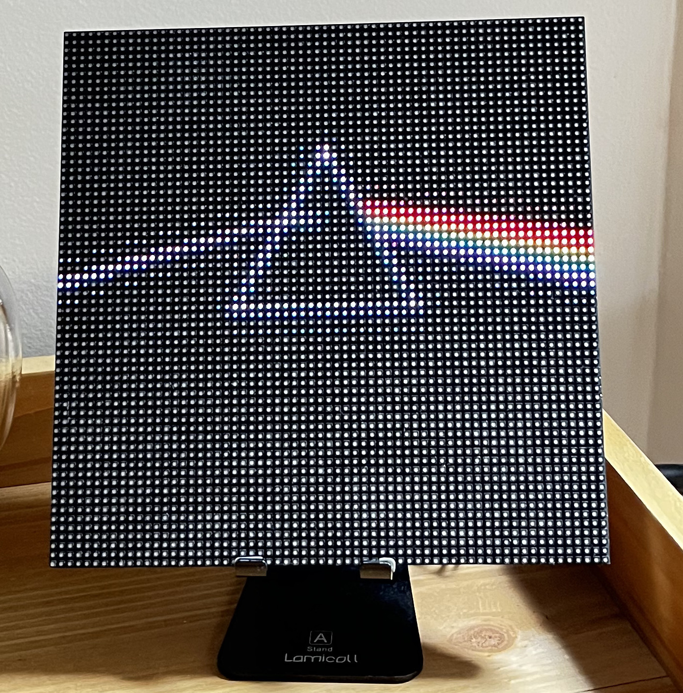
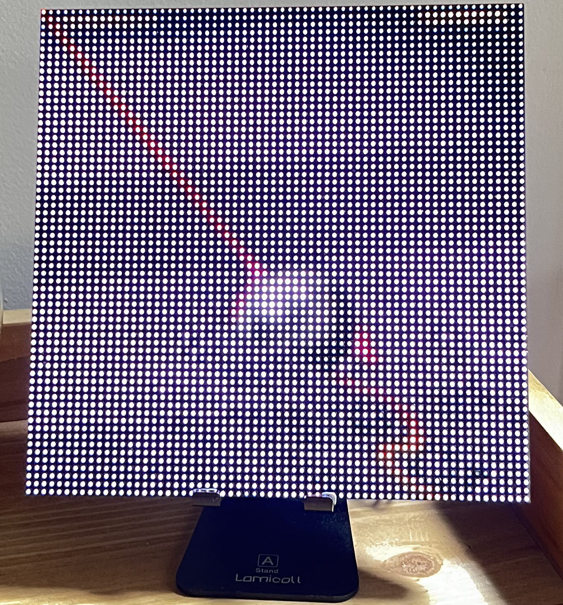
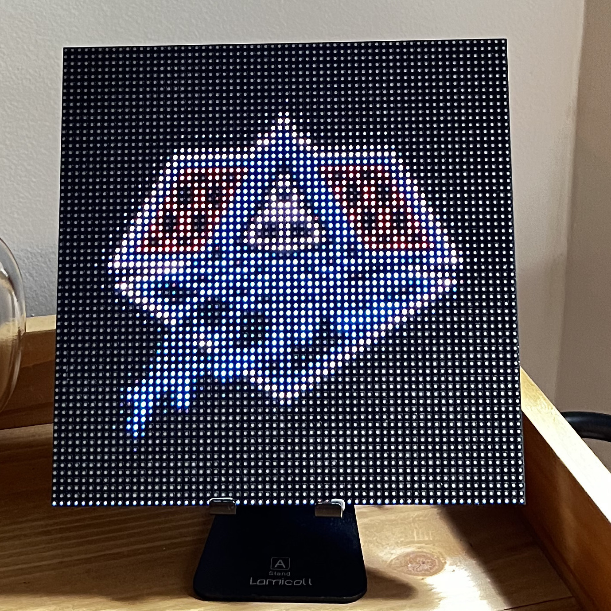

# πxelate

[](https://goreportcard.com/report/github.com/bthuilot/pixelate)


*Note*: This project was inspired by [@rwardtech](https://www.tiktok.com/@rwardtech) on TikTok and his SpotiPi project which can be view [here on GitHub](https://github.com/ryanwa18/spotipi).


## Examples

 |                      Pink Floyd - Dark side of the Moon                       |                        Tame Impala - Currents                         |                      Daft Punk - Alive (2007)                      |
|:-----------------------------------------------------------------------------:|:---------------------------------------------------------------------:|:------------------------------------------------------------------:|
 |  |  |  |


## Hardware Needed

1. [Raspberry Pi](https://www.raspberrypi.com/products/) & SD Card with Raspbian installed
2. [64x64 RGB Matrix](https://www.adafruit.com/product/3649)
3. [Adafruit Matrix Bonnet Hat](https://www.adafruit.com/product/3211)
4. [5V 10A A/C Adapter](https://www.adafruit.com/product/658)

## Up and Running

To Install:
1. navigate to the releases tab and download the latest GZip of the binary.
2. Create the file `config.yml` in the folder `/etc/pixelate/` (an example is shown in [`example.config.yml`](/example.config.yml))
3. Run the binary

### Build from source

```bash
# Clone the repo
git clone --recurse-submodules github.com/bthuilot/pixelate
cd pixelate
# Build project and dependencies
make

cp example.config.yml config.yml
# Edit the config.yml ...
sudo make install

/usr/local/bin/pixlate
```

## Supported screens

A "Screen" represents a service that will render to the display.

The current list of "screen" values are:

- **Spotify**: Render the currently playing album to the board
- **Wifi QR Code**: Render a QR code to join a wifi network
